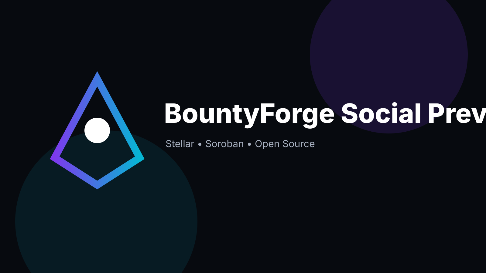
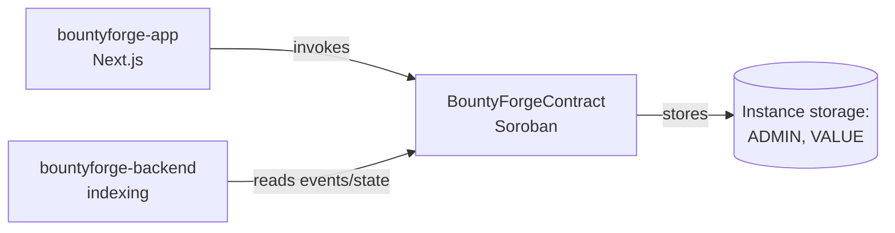

<p align="center">
  
</p>

# BountyForge Contracts

> Open bounties with escrow, review, and payout workflows — on-chain Soroban contracts.


> **Status note:** v0.1.0 development baseline — **not audited and not production-ready.**

## Why this exists

BountyForge implements open bounties with escrow, review, and payout workflows on Stellar. On-chain state is the source of truth, and this repository holds the **Soroban smart contracts** that own that state and its authorization rules.

| Repo | Role |
| --- | --- |
| **bountyforge-contracts** (this repo) | On-chain Soroban escrow and bounty state |
| [bountyforge-app](https://github.com/stellar-bountyforge/bountyforge-app) | User-facing web application |
| [bountyforge-backend](https://github.com/stellar-bountyforge/bountyforge-backend) | Off-chain indexing/API and operational services |

## Features

- `BountyForgeContract` Soroban contract written in Rust (`#![no_std]`).
- `initialize(admin)` — set the contract admin (requires auth).
- `record(actor, value)` — store a value (requires actor auth).
- `read()` — read the stored value.
- Rust unit tests via `soroban-sdk` test utils.
- Release profile tuned for small on-chain footprint (`opt-level = "z"`, LTO, stripped symbols).

## Architecture



## Tech stack

| Layer | Technology |
| --- | --- |
| Language | Rust 2021 (`no_std`) |
| Smart contracts | Soroban SDK 28 |
| Build | `stellar contract build` / Cargo |
| Testing | `cargo test` |

## Project structure

```text
bountyforge-contracts/
├── contracts/
│   └── bountyforge/     # The Soroban contract crate
│       └── src/lib.rs
├── assets/              # Banner and logo
├── Makefile             # test / build / fmt targets
└── .github/             # CI workflow, CODEOWNERS
```

## Prerequisites

- Rust (stable) with `wasm32v1-none` target: `rustup target add wasm32v1-none`
- Stellar CLI (for `make build` / `stellar contract build`)

## Installation

```bash
cargo build
```

## Environment variables

There is no `.env.example` — the contract crate itself needs no environment variables. Deployment-time values (admin address, network) are passed as invoke arguments. See the sibling repos for app/backend env vars.

## Building

```bash
make build          # stellar contract build (produces .wasm)
```

## Testing

```bash
make test           # cargo test
```

## Formatting

```bash
make fmt            # cargo fmt --all -- --check
```

## Roadmap

- [ ] Expand the contract with real escrow, review, and payout state machines.
- [ ] Add explicit admin-gated write paths and access control beyond the initial baseline.
- [ ] Add a deployment script/Makefile target for testnet.
- [ ] Independent security audit before any mainnet use.

## Contributing

See [CONTRIBUTING.md](CONTRIBUTING.md).

## Security

See [SECURITY.md](SECURITY.md). **This project is unaudited** — do not use in production or hold real value against it.

## Code of Conduct

See [CODE_OF_CONDUCT.md](CODE_OF_CONDUCT.md).

## Maintainer

**Hikmaholadele** — [@Hikmaholadele](https://github.com/Hikmaholadele)

## License

[Apache-2.0](LICENSE)
